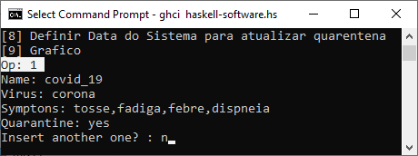

_Lucas Ribeiro Mendes – a46676_

O programa foi desenvolvido inicialmente no WinHugs, porém como o WinHugs não possuia a biblioteca de manipulação de datas &quot;Data.Time&quot;, foi necessário migrar o código para o GHCI, programa instalado por esse link: [https://hub.zhox.com/posts/chocolatey-introduction](https://hub.zhox.com/posts/chocolatey-introduction).

### Execução
O programa pode ser executado no terminal do windows com o comando:
 &quot;_ghci haskell-software.hs_&quot;.
 

### Funcionamento
Inicia-se com o &quot;main&quot; e a função contém 9 funcionalidades, além de identificar a data atual do sistema. Essa data define quais pacientes permanecem em quarentena, se a data de saída do paciente for maior ou igual a data do sistema, esse paciente sairá da lista de quarentena. A data do sistema pode ser modificada no _OP 8._

### Operações
**OP 1** : Trata-se da operação para inserir doenças, a qual permite o cadastro de doenças e seus sintomas.
Obs: Os sintomas devem ser separados por vírgula.

 

**OP 2:** : Trata-se do cadastro de pacientes, novamente os sintomas devem ser separados por vírgula e a data deve ser inserida no formato dia-mes-ano.
Caso o mes/dia seja menor que 10, deve-se entrar com 0 na frente - Exemplo: 2020-06-01.

 

**OP 3:** A operação 3 lista todas as doenças cadastradas no sistema.

 

**OP 4:** A operação 4 lista todos os pacientes cadastrados no sistema.

 

**OP 5:** A operação 5 lista todos os pacientes que estão em quarentena atualmente.

 

**OP 6:** A operação 6 conta o número de pacientes em quarentena.

 

**OP 7:** A operação 7 recebe o nome de um paciente e verifica qual o vírus do paciente. Caso o nome não seja encontrado (exemplo: Joao != joao) o sistema retorna que o nome de paciente não foi encontrado.

 

**OP 8:** A operação 8 recebe uma data no formato ano-mes-dia e atualiza a data do sistema para essa nova data. Avisando logo em seguida quais pacientes permaneceram na quarentena e quais sairam da quarentena com a nova data.

 

**OP 9:** A operação 9 cria um gráfico de *paciente -> virus*, realizando uma busca cruzada entre as listas de pacientes e doenças.
